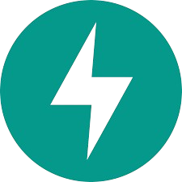

- 👋 Hi, I’m @Josh-dotcom-prog
- My name is EDYANGU JOSHUA
- 👀 I’m interested in programming e.g. web development, application and software development, sysAdmin, DBA
- 🌱 I’m currently persuing a Diploma in computer science at Uganda Institute of Information and Communications Technology
- 💞️ I’m looking to collaborate on projects
- 📫 How to reach me +256762521458/+256754110547 email: edyangujoshua@gmail.com

## 🧰 & </> Languages and Tools

    <a href="https://www.github.com/Josh-dotcom-prog" target="_blank" rel="noreferrer"> 
    <picture> 
      <source media="(prefers-color-scheme: dark)" srcset="https://raw.githubusercontent.com/danielcranney/readme-generator/main/public/icons/socials/github-dark.svg" /> 
      <source media="(prefers-color-scheme: light)" srcset="https://raw.githubusercontent.com/danielcranney/readme-generator/main/public/icons/socials/github.svg" /> 
       
    </picture> 
  </a> <a href="https://code.visualstudio.com/" target="_blank" rel="noreferrer">

## Other Specialties:
**Operating System** 
      
**Computers** 
 

📊 Stats

| GitHub Stats | Streak Stats |
|:------------:|:------------:|
|  |  |
 

Socials

 
  <a href="https://www.linkedin.com/in/your-linkedin-profile" target="_blank" rel="noreferrer"> 
    <picture> 
      <source media="(prefers-color-scheme: dark)" srcset="https://raw.githubusercontent.com/danielcranney/readme-generator/main/public/icons/socials/linkedin-dark.svg" /> 
      <source media="(prefers-color-scheme: light)" srcset="https://raw.githubusercontent.com/danielcranney/readme-generator/main/public/icons/socials/linkedin.svg" /> 
       
    </picture> 
  </a> 
  <a href="https://www.instagram.com/your-instagram-handle" target="_blank" rel="noreferrer"> 
    <picture> 
      <source media="(prefers-color-scheme: dark)" srcset="https://raw.githubusercontent.com/danielcranney/readme-generator/main/public/icons/socials/instagram-dark.svg" /> 
      <source media="(prefers-color-scheme: light)" srcset="https://raw.githubusercontent.com/danielcranney/readme-generator/main/public/icons/socials/instagram.svg" /> 
       
    </picture> 
  </a>
  <a href="https://www.facebook.com/your-facebook-profile" target="_blank" rel="noreferrer"> 
    <picture> 
      <source media="(prefers-color-scheme: dark)" srcset="https://raw.githubusercontent.com/danielcranney/readme-generator/main/public/icons/socials/facebook-dark.svg" /> 
      <source media="(prefers-color-scheme: light)" srcset="https://raw.githubusercontent.com/danielcranney/readme-generator/main/public/icons/socials/facebook.svg" /> 
       
    </picture> 
  </a>
  <a href="https://www.x.com/your-twitter-handle" target="_blank" rel="noreferrer"> 
    <picture> 
      <source media="(prefers-color-scheme: dark)" srcset="https://raw.githubusercontent.com/danielcranney/readme-generator/main/public/icons/socials/twitter-dark.svg" /> 
      <source media="(prefers-color-scheme: light)" srcset="https://raw.githubusercontent.com/danielcranney/readme-generator/main/public/icons/socials/twitter.svg" /> 
       
    </picture> 
  </a>
  

